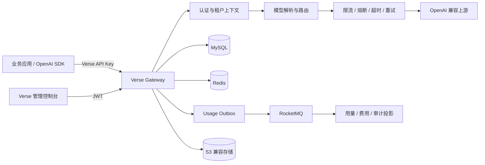

# Verse Gateway

> 一个具备多租户治理、可靠用量计费与可观测能力的 OpenAI 兼容 LLM 网关。

[](https://openjdk.org/)
[](https://spring.io/projects/spring-boot)
[](https://maven.apache.org/)
[](#成熟度说明)

Verse 为组织内部应用提供统一的模型访问入口。它负责 API Key 认证、租户隔离、模型路由、流量治理、失败恢复、审计和成本核算，让业务应用无需分别维护上游厂商的地址、凭证和计费规则。应用只需接入一个网关地址和一枚 Verse API Key，即可使用租户内已配置的模型服务。

- 管理控制台：[Yonagi04/Verse-FE](https://github.com/Yonagi04/Verse-FE)
- 默认服务端口：`8080`
- 兼容接口前缀：`/api/v1/openai`

## 为什么是 Verse

- **统一接入**：通过 OpenAI Chat Completions 兼容端点调用不同上游服务，支持普通响应与 SSE 流式响应。
- **租户隔离**：用户、模型服务、API Key、审计与用量数据均归属租户上下文。
- **服务治理**：提供 RPM/TPM 限流、熔断、超时、同模型重试与故障降级机制。
- **安全管理**：JWT 与 API Key 分离认证，上游密钥加密存储，敏感数据支持加密与哈希查询。
- **成本可见**：归一化不同供应商的 Token 用量，支持价格配置、峰谷时段计费、多维报表与导出。
- **可追溯**：记录请求状态、耗时、Token 和费用；完整载荷可存放于 S3 兼容对象存储。
- **异步解耦**：使用 RocketMQ 处理审计、通知和计数等副作用，并通过 Outbox 保证用量事件的可靠投递。

## 系统边界



同步链路负责鉴权、路由和响应透传；审计、计数、通知及用量投影等副作用尽量异步执行。用量链路采用数据库事实记录与 Outbox，降低“请求成功但计费事件丢失”的风险。

## 功能矩阵

| 模块 | 能力 |
| --- | --- |
| OpenAI 兼容网关 | `GET /models`、`POST /chat/completions`、SSE、OpenAI 风格错误结构、请求 ID |
| 服务注册与路由 | 租户级模型服务、状态管理、标签、服务信息、候选服务解析与故障降级 |
| 流量治理 | 租户/API Key/模型多级 RPM 与 TPM 限流、熔断、调用硬超时、流空闲超时、短重试 |
| 身份与权限 | JWT 管理面认证、API Key 调用面认证、角色权限、租户上下文强隔离 |
| 用量计费 | 多厂商 Usage 归一化、价格快照、缓存 Token、推理 Token、峰谷时段、小时聚合 |
| 报表 | 仪表盘、概览、时序、多维拆分、筛选项、Excel 导出、数据补偿与对账 |
| 审计 | 调用元数据、请求/响应摘要、S3 详情存储、普通与流式调用追踪 |
| 协作 | 租户邀请与加入申请、成员角色、通知、WebSocket 未读提醒 |
| 账户安全 | 敏感字段加密、登录设备与历史、隐私设置、密码重置、账户注销 |

## 技术选型

| 层次 | 组件 |
| --- | --- |
| Runtime | Java 21, Spring Boot 3.2 |
| Web | Spring MVC, WebFlux/Reactor Netty, WebSocket/STOMP |
| Security | Spring Security, JWT, BCrypt, AES-256-GCM |
| Persistence | MyBatis-Plus, MySQL, HikariCP |
| Cache & resilience | Redis/Redisson, Resilience4j |
| Messaging | RocketMQ, transactional Outbox |
| Object storage | AWS SDK for Java v2 / S3-compatible storage |
| Reporting | EasyExcel, hourly aggregate projection |
| Test | JUnit 5, Spring Boot Test, MockMvc |

## 本地开发

### 前置条件

- JDK 21 与 Maven 3.9+
- MySQL 8.x
- Redis
- RocketMQ NameServer 与 Broker
- S3 兼容对象存储；本地开发可选择 MinIO

### 数据库初始化

首次启动前执行完整 schema：

```bash
mysql -u root -p < src/main/resources/schema.sql
```

### 配置

默认配置位于 `src/main/resources/application.yml`。建议在本地 profile 或部署平台中覆盖数据库、Redis、RocketMQ 和 S3 地址，敏感值至少通过以下环境变量注入：

| 环境变量 | 用途 |
| --- | --- |
| `JWT_SECRET` | 管理面 JWT 签名密钥 |
| `AES_KEY` | 上游凭证及隐私字段加密密钥（Base64） |
| `HASH_PEPPER` | 可检索敏感字段的哈希 pepper |
| `S3_ENDPOINT` / `S3_REGION` | 对象存储地址与区域 |
| `S3_ACCESS_KEY` / `S3_SECRET_KEY` | 对象存储凭证 |
| `S3_BUCKET` / `S3_BASE_URL` | Bucket 与外部访问基址 |

Spring Boot 的标准外部化配置同样可用于覆盖 `spring.datasource.*`、`spring.data.redis.*` 和 `rocketmq.*`。

生产环境必须替换示例密钥与数据库凭证，并按部署环境设置独立密钥。

### 启动与验证

```bash
mvn compile -q
mvn spring-boot:run -Dspring-boot.run.profiles=dev
```

完成注册、创建租户、注册模型并生成 API Key 后：

```bash
curl http://localhost:8080/api/v1/openai/models \
  -H "Authorization: Bearer sk_your_verse_key"
```

```bash
curl http://localhost:8080/api/v1/openai/chat/completions \
  -H "Authorization: Bearer sk_your_verse_key" \
  -H "Content-Type: application/json" \
  -d '{
    "model": "your-model-name",
    "messages": [{"role": "user", "content": "Explain LLM gateways briefly."}],
    "stream": true
  }'
```

## 构建与测试

```bash
mvn test                       # 全量测试
mvn test -Dtest=ClassName      # 指定测试类
mvn clean package -DskipTests  # 构建可执行 JAR
```

测试覆盖认证与租户上下文、全局异常、限流、模型转发事件发布、用量归一化与成本计算、Outbox Relay/DLQ、报表与导出等关键链路。

## 代码结构

```text
src/main/java/com/yonagi/verse/
├── controller/       # REST 与 OpenAI 兼容端点
├── service/          # 领域服务、转发、定价与用量归一化
├── dao/              # MyBatis-Plus Entity、Mapper 与查询投影
├── dto/              # 请求、响应及导出模型
├── resilience/       # 限流、熔断、超时与降级抽象
├── async/            # MQ 事件、Handler、Outbox 与 DLQ 观察
├── job/              # 用量聚合与补偿任务
└── common/           # 安全上下文、配置、异常、响应与工具类

src/main/resources/
├── application.yml
└── schema.sql
```

## 接口与响应约定

- 管理面接口统一位于 `/api/v1/**`，使用 JWT，并返回 `Result<T>` 响应包装。
- 模型调用面位于 `/api/v1/openai/**`，使用 Verse API Key，并保持 OpenAI 兼容响应，不套 `Result<T>`。
- 普通和流式模型调用均返回 `x-request-id`，可用于日志关联和审计查询。
- 限流响应使用 HTTP `429` 并携带 `Retry-After`。

## 运维关注点

- 监控 RocketMQ 消费积压与 `%DLQ%verse-event-consumer` 死信数量。
- 监控用量 Outbox 的待投递量、失败次数和最老事件年龄。
- 定期核对原始用量、成本事实表与小时聚合结果。
- 为 MySQL、Redis、RocketMQ 和对象存储设置独立的生产凭证、备份与容量告警。
- 通过 `verse.llm.*` 配置审慎调整超时、重试、报表范围及导出并发。

## 成熟度说明

Verse 处于积极开发阶段。核心调用链路、管理面、用量计费和可靠事件链路已经落地，但 API 与 schema 仍可能演进。当前仓库尚未提供统一容器编排、正式 Release 流程和开源许可证，生产使用前应完成容量、安全与灾备评估。

## 参与开发

提交改动前请保持既有分层与统一响应约定，并至少运行：

```bash
mvn compile -q
mvn test
```

Bug 报告请包含复现步骤、期望/实际行为、相关 `x-request-id` 与脱敏后的日志。安全问题请避免在公开 Issue 中披露密钥、请求正文或个人信息。

> 本仓库当前未声明开源许可证。在许可证补充前，代码默认保留全部权利。
