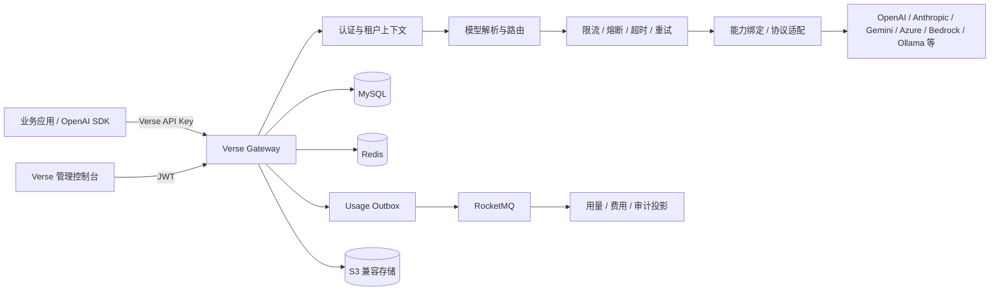

# Verse Gateway

> 一个具备多协议适配、多租户治理、可靠用量计费与私有 Playground 的 LLM 网关。

[](https://openjdk.org/)
[](https://spring.io/projects/spring-boot)
[](https://maven.apache.org/)
[](#成熟度说明)

Verse 为组织内部应用提供统一的模型访问入口。它负责 API Key 认证、租户隔离、模型路由、流量治理、失败恢复、审计和成本核算，让业务应用无需分别维护上游厂商的地址、凭证和计费规则。应用只需接入一个网关地址和一枚 Verse API Key，即可使用租户内已配置的模型服务。

- 管理控制台：[Yonagi04/Verse-FE](https://github.com/Yonagi04/Verse-FE)
- 默认服务端口：`8080`
- 兼容接口前缀：`/api/v1/openai`
- 自定义 Rerank 接口：`/api/v1/rerank`

## 为什么是 Verse

- **统一接入**：提供 Chat Completions、Responses、Embeddings、图像生成、音频转写、语音生成及 Rerank，按模型能力绑定适配不同上游协议。
- **租户隔离**：用户、模型服务、API Key、审计与用量数据均归属租户上下文。
- **服务治理**：提供 RPM/TPM 限流、熔断、超时、同模型重试与故障降级机制。
- **安全管理**：JWT 与 API Key 分离认证，上游密钥加密存储，敏感数据支持加密与哈希查询。
- **成本可见**：归一化不同供应商的 Token 用量，支持价格配置、峰谷时段计费、多维报表与导出。
- **可追溯**：记录请求状态、耗时、Token 和费用；完整载荷可存放于 S3 兼容对象存储。
- **异步解耦**：使用 RocketMQ 处理审计、通知和计数等副作用，并通过 Outbox 保证用量事件的可靠投递。
- **交互调试**：租户成员使用 JWT 即可进入私有 Playground，支持流式对话、最多三路模型对比与版本化预设。
- **租户协作**：提供租户概览、收藏与置顶、角色裁剪的用量摘要、活动记录和最近通知。
- **外部账号**：支持 GitHub、GitLab.com、Google 与飞书登录、注册衔接、账号绑定和解绑。

## 系统边界


```mermaid
flowchart LR
    Client[业务应用 / OpenAI SDK] -->|Verse API Key| Gateway[Verse Gateway]
    Console[Verse 管理控制台] -->|JWT| Gateway
    Gateway --> Auth[认证与租户上下文]
    Auth --> Route[模型解析与路由]
    Route --> Guard[限流 / 熔断 / 超时 / 重试]
    Guard --> Adapter[能力绑定 / 协议适配]
    Adapter --> Provider[OpenAI / Anthropic / Gemini / Azure / Bedrock / Ollama 等]
    Gateway --> MySQL[(MySQL)]
    Gateway --> Redis[(Redis)]
    Gateway --> Outbox[Usage Outbox]
    Outbox --> MQ[RocketMQ]
    MQ --> Usage[用量 / 费用 / 审计投影]
    Gateway --> S3[(S3 兼容存储)]
```

同步链路负责鉴权、路由和响应透传；审计、计数、通知及用量投影等副作用尽量异步执行。用量链路采用数据库事实记录与 Outbox，降低“请求成功但计费事件丢失”的风险。

## 功能矩阵

| 模块 | 能力 |
| --- | --- |
| 模型调用网关 | Chat Completions / Responses（普通与 SSE）、Embeddings、Rerank、图像生成、音频转写、语音生成、OpenAI 风格错误结构、请求 ID |
| 服务注册与路由 | 租户级模型服务、显式操作与协议绑定、凭据模式、协议专用配置、状态与标签管理、候选服务解析与故障降级 |
| 流量治理 | 租户/API Key/模型多级 RPM 与 TPM 限流、熔断、调用硬超时、流空闲超时、短重试 |
| 身份与权限 | JWT 管理面认证、API Key 调用面认证、角色权限、租户上下文强隔离 |
| 用量计费 | 多厂商 Usage 归一化、价格快照、缓存 Token、推理 Token、峰谷时段、小时聚合 |
| 报表 | 仪表盘、概览、时序、多维拆分、筛选项、Excel 导出、数据补偿与对账 |
| 审计 | 调用元数据、请求/响应摘要、S3 详情存储、普通与流式调用追踪 |
| 协作 | 租户邀请与加入申请、成员角色、通知、WebSocket 未读提醒 |
| 租户管理 | 品牌图片、收藏与置顶、跨已加入租户的只读概览、近 30 天用量摘要、角色裁剪的待办、活动记录与查询 |
| Playground | 成员私有会话、流式文本对话、幂等发送、最多三路对比、参数配置、停止与重试、分叉、预设版本与恢复 |
| 账户安全 | 敏感字段加密、登录设备与来源记录、隐私设置、密码重置、账户注销、外部账号登录及绑定/解绑 |

## 模型能力与协议

客户端使用 Verse 注册的模型名称；路由同时匹配操作类型与已启用的能力绑定。供应商名称本身不会自动启用某项能力，实际可用操作取决于绑定配置及上游模型。

以下接口均使用 `Authorization: Bearer <Verse API Key>`：

| 方法与路径 | 操作 | 响应形式 |
| --- | --- | --- |
| `GET /api/v1/openai/models` | 模型列表 | JSON |
| `POST /api/v1/openai/chat/completions` | `CHAT_COMPLETIONS` | JSON / SSE |
| `POST /api/v1/openai/responses` | `RESPONSES` | JSON / 命名 SSE 事件 |
| `POST /api/v1/openai/embeddings` | `EMBEDDINGS` | JSON |
| `POST /api/v1/openai/images/generations` | `IMAGE_GENERATION` | JSON |
| `POST /api/v1/openai/audio/transcriptions` | `TRANSCRIPTION` | Multipart 上传，按格式返回转写结果 |
| `POST /api/v1/openai/audio/speech` | `SPEECH` | 音频二进制 |
| `POST /api/v1/rerank` | `RERANK` | JSON（Verse 自定义接口） |

| 上游协议 | 支持的操作 | 凭据与专用配置 |
| --- | --- | --- |
| `OPENAI_COMPAT` | 除 Rerank 外的上述调用操作 | `API_KEY`；`apiUrl` 为包含版本前缀的 API 基址 |
| `ANTHROPIC_MESSAGES` | Chat Completions | `API_KEY`；`provider=anthropic` |
| `GEMINI_GENERATE_CONTENT` | Chat Completions、Embeddings、图像生成 | `API_KEY`；`provider=gemini` |
| `AZURE_OPENAI_V1` | 除 Rerank 外的上述调用操作 | `API_KEY`；`provider=azure` |
| `AZURE_OPENAI_DEPLOYMENT` | Chat Completions、Embeddings、图像生成、音频转写、语音生成 | `API_KEY`；`provider=azure`，配置 `deployment` 与 `apiVersion` |
| `BEDROCK_CONVERSE` | Chat Completions | `AWS_CHAIN`；`provider=bedrock`，配置 `region`，使用 AWS 默认凭据链 |
| `OLLAMA_NATIVE` | Chat Completions、Embeddings | `NONE`；`provider=ollama`，配置服务地址 |
| `OPENROUTER_RERANK` | Rerank | `API_KEY`；`provider=openrouter` |

模型服务通过 `capabilities` 配置 `operation`、`upstreamProtocol` 与 `enabled`；通过 `credentialMode` 和 `providerSettings` 配置凭据模式及协议选项。省略 `capabilities` 时保留旧版 `CHAT_COMPLETIONS + OPENAI_COMPAT` 行为。

媒体请求和响应默认上限为 25 MiB，图像 JSON 默认上限为 8 MiB，可通过 `verse.llm.media.*` 调整；上传时还需同步调整 `spring.servlet.multipart.*`。

## Playground 与租户工作区

Playground 使用管理面 JWT，无需创建 API Key。管理员通过租户设置中的 `playgroundEnabled` 开启入口（新租户默认关闭），成员只能访问本人在当前租户中的会话和工作区。

- **私有对话**：模型列表、示例提示词、会话搜索与历史、模型切换、流式发送和幂等防重，入口为 `/api/v1/tenants/{tenantId}/playground`。
- **对比工作台**：入口为上述路径下的 `/workbench`，支持最多三路模型并行对比、同步或独立参数、停止、重试、分叉，以及个人预设的版本保存与恢复。
- **参数能力**：在模型服务的 `providerSettings.playground` 中以 JSON 字符串声明 `system`、`temperature`、`topP`、`maxTokens` 能力及范围。Playground 输出上限与普通 API 的 `maxOutputTokens` 分别配置。
- **治理与隐私**：复用租户与模型治理，并增加租户/模型维度的 Playground 限流（每分钟 6 次、每小时 120 次）。调用用量与审计标记为 `PLAYGROUND`，共享审计查询隐藏对话正文与预览。

租户首页通过 `/api/v1/tenants/overview` 及 `/{tenantId}/overview` 获取摘要；管理员查看租户用量和适用的待办，普通成员查看本人用量。收藏与置顶通过 `PUT /api/v1/tenants/{tenantId}/preference` 保存为个人偏好。活动记录由租户设置中的 `activityRecordingEnabled` 控制，并通过 `/{tenantId}/activities/status` 与 `/{tenantId}/activities` 查询；最近通知入口为 `/api/v1/notifications/recent`。

## 技术选型

| 层次 | 组件 |
| --- | --- |
| Runtime | Java 21, Spring Boot 3.2 |
| Web | Spring MVC, WebFlux/Reactor Netty, WebSocket/STOMP |
| Security | Spring Security, JWT, OAuth2/OIDC, BCrypt, AES-256-GCM |
| Persistence | MyBatis-Plus, MySQL, HikariCP |
| Cache & resilience | Redis/Redisson, Resilience4j |
| Messaging | RocketMQ, transactional Outbox |
| AWS integration | AWS SDK for Java v2 / S3-compatible storage / Bedrock Runtime |
| Reporting | EasyExcel, hourly aggregate projection |
| Test | JUnit 5, Spring Boot Test, MockMvc |

## 本地开发

### 前置条件

- JDK 21 与 Maven 3.9+
- MySQL 8.x
- Redis
- RocketMQ NameServer 与 Broker
- S3 兼容对象存储；本地开发可选择 MinIO

### 数据库初始化

首次启动前执行基础 schema：

```bash
mysql -u root -p < src/main/resources/schema.sql
```

### 配置

默认配置位于 `src/main/resources/application.yml`，`dev` profile 加载 `application-dev.yml`。建议在本地 profile 或部署平台中覆盖数据库、Redis、RocketMQ 和 S3 地址，敏感值至少通过以下环境变量注入：

| 环境变量 | 用途 |
| --- | --- |
| `JWT_SECRET` | 管理面 JWT 签名密钥 |
| `AES_KEY` | 上游凭证及隐私字段加密密钥（Base64） |
| `HASH_PEPPER` | 可检索敏感字段的哈希 pepper |
| `S3_ENDPOINT` / `S3_REGION` | 对象存储地址与区域 |
| `S3_ACCESS_KEY` / `S3_SECRET_KEY` | 对象存储凭证 |
| `S3_BUCKET` / `S3_BASE_URL` | Bucket 与外部访问基址 |

Spring Boot 的标准外部化配置同样可用于覆盖 `spring.datasource.*`、`spring.data.redis.*` 和 `rocketmq.*`。

生产环境必须替换示例密钥与数据库凭证，并按部署环境设置独立密钥。

### 外部账号登录与绑定（可选）

外部认证总开关及各平台开关默认关闭。启用所需平台时配置：

| 环境变量 | 用途 |
| --- | --- |
| `VERSE_EXTERNAL_AUTH_ENABLED` | 外部认证总开关，设为 `true` |
| `VERSE_FRONTEND_ORIGIN` | 唯一可信前端来源，默认 `http://localhost:3000` |
| `VERSE_GITHUB_ENABLED` / `VERSE_GITLAB_ENABLED` / `VERSE_GOOGLE_ENABLED` | 对应平台开关 |
| `VERSE_GITHUB_CLIENT_ID` / `VERSE_GITHUB_CLIENT_SECRET` | GitHub OAuth 应用凭据 |
| `VERSE_GITLAB_CLIENT_ID` / `VERSE_GITLAB_CLIENT_SECRET` | GitLab.com 应用凭据 |
| `VERSE_GOOGLE_CLIENT_ID` / `VERSE_GOOGLE_CLIENT_SECRET` | Google 应用凭据 |
| `VERSE_FEISHU_ENABLED` | 飞书登录开关，默认 `false` |
| `VERSE_FEISHU_APP_ID` / `VERSE_FEISHU_APP_SECRET` | 飞书 App ID / App Secret，仅后端使用 |
| `VERSE_EXTERNAL_AUTH_PROXY_URL` | 可选后端出站代理，支持 `http`、`socks`、`socks5` |
| `VERSE_EXTERNAL_AUTH_CONNECT_TIMEOUT` / `VERSE_EXTERNAL_AUTH_READ_TIMEOUT` | 平台请求超时，默认 `5s` / `15s` |

平台应用的回调地址需设为 `${VERSE_FRONTEND_ORIGIN}/api/v1/auth/external/callback/{provider}`，其中 `provider` 为 `github`、`gitlab`、`google` 或 `feishu`。前端同源代理或反向代理必须将该 `/api` 地址转发到后端；回调完成后跳转至前端 `/auth/external/callback` 页面。

登录流程入口为 `/api/v1/auth/external`，已登录用户的绑定管理入口为 `/api/v1/users/me/external-accounts`。前端发起受来源校验的操作时需携带匹配的 `Origin`、`Content-Type: application/json` 和 `X-Requested-With: XMLHttpRequest`，并保留流程 Cookie。绑定与解绑需要近期身份验证；系统阻止移除最后一种可用登录方式。

飞书的应用创建、凭证获取、重定向 URL、可用范围与验收步骤见 [飞书登录配置](src/main/resources/feishu-login-setup.md)。

### 启动与验证

```bash
mvn compile -q
mvn spring-boot:run -Dspring-boot.run.profiles=dev
```

完成注册、创建租户、注册模型并生成 API Key 后：

```bash
curl http://localhost:8080/api/v1/openai/models \
  -H "Authorization: Bearer sk_your_verse_key"
```

```bash
curl http://localhost:8080/api/v1/openai/chat/completions \
  -H "Authorization: Bearer sk_your_verse_key" \
  -H "Content-Type: application/json" \
  -d '{
    "model": "your-model-name",
    "messages": [{"role": "user", "content": "Explain LLM gateways briefly."}],
    "stream": true
  }'
```

## 构建与测试

```bash
mvn test                       # 全量测试
mvn test -Dtest=ClassName      # 指定测试类
mvn clean package -DskipTests  # 构建可执行 JAR
```

测试覆盖认证与租户上下文、全局异常、限流、协议适配与能力路由、模型转发事件发布、用量归一化与成本计算、Outbox Relay/DLQ、报表与导出、租户概览与偏好、Playground 流式调用及工作台、外部认证等关键链路。GitHub Actions CI 使用 Java 21 执行 `mvn --batch-mode clean verify`。

## 代码结构

```text
src/main/java/com/yonagi/verse/
├── controller/       # REST 与 OpenAI 兼容端点
├── service/          # 领域服务、协议适配、Playground、外部认证、定价与用量归一化
├── dao/              # MyBatis-Plus Entity、Mapper 与查询投影
├── dto/              # 请求、响应及导出模型
├── resilience/       # 限流、熔断、超时与降级抽象
├── async/            # MQ 事件、Handler、Outbox 与 DLQ 观察
├── job/              # 用量聚合与补偿任务
└── common/           # 安全上下文、配置、异常、响应与工具类

src/main/resources/
├── application.yml
├── application-dev.yml
├── schema.sql
└── db/migration/     # 需手动执行的增量 SQL
```

## 接口与响应约定

- 管理面接口位于 `/api/v1/**`，除注册、登录及部分外部认证等公开端点外使用 JWT，普通响应返回 `Result<T>`。
- 模型调用面位于 `/api/v1/openai/**` 与 `/api/v1/rerank`，使用 Verse API Key，直接返回 JSON、SSE 或媒体内容，不套 `Result<T>`。
- Playground 使用 JWT；普通接口返回 `Result<T>`，生成接口返回命名 SSE 事件，前置失败返回 JSON 错误。
- 普通和流式模型调用均返回 `x-request-id`，可用于日志关联和审计查询。
- 模型调用限流返回 HTTP `429`；OpenAI 兼容端点同时携带 `Retry-After`，Playground 的独立限流在错误数据中返回原因与重试等待时间。

## 运维关注点

- 监控 RocketMQ 消费积压与 `%DLQ%verse-event-consumer` 死信数量。
- 监控用量 Outbox 的待投递量、失败次数和最老事件年龄。
- 监控领域事件 Outbox 的 Relay、重试与消费对账状态，通过 `verse.async.domain-outbox.*` 调整投递和维护参数。
- 定期核对原始用量、成本事实表与小时聚合结果。
- 为 MySQL、Redis、RocketMQ 和对象存储设置独立的生产凭证、备份与容量告警。
- 通过 `verse.llm.*` 配置审慎调整超时、重试、报表范围及导出并发。

## 成熟度说明

Verse 处于积极开发阶段。多协议调用链路、管理面、用量计费、可靠事件链路、Playground 工作台与外部账号认证已经落地，但 API 与 schema 仍可能演进。当前仓库已提供构建测试 CI，尚未提供统一容器编排、正式 Release 流程和开源许可证，生产使用前应完成容量、安全与灾备评估。

## 参与开发

提交改动前请保持既有分层与统一响应约定，并至少运行：

```bash
mvn compile -q
mvn test
```

Bug 报告请包含复现步骤、期望/实际行为、相关 `x-request-id` 与脱敏后的日志。安全问题请避免在公开 Issue 中披露密钥、请求正文或个人信息。

> 本仓库当前未声明开源许可证。在许可证补充前，代码默认保留全部权利。
